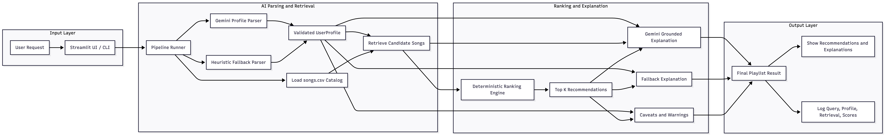

# AI Playlist Assistant

## Title and Summary

AI Playlist Assistant is a music recommendation app that turns a natural-language request like "quiet Sunday morning coffee music" into a small, explainable playlist. It combines a deterministic recommender with Gemini-powered language understanding so the system can parse intent, retrieve relevant songs from a catalog, rank them transparently, and explain why each recommendation was chosen.

This project matters because it shows how to build an AI feature that is useful, testable, and grounded in real application logic instead of acting like a standalone chatbot. The LLM does not replace the recommender; it improves how users interact with it and how the system explains its decisions.

## Original Project

This project started as **Music Recommender Simulation**, a rule-based recommender from Modules 1-3. The original goal was to model songs and user taste profiles as structured data, score songs with hand-written rules, and reflect on how simple recommendation systems can still encode bias and tradeoffs.

In its original form, the app matched songs to users using genre, mood, energy, and acoustic preference. It was useful for demonstrating transparent scoring, but it only supported structured inputs and did not feel like a full AI application.

## What the Upgraded Project Does

The upgraded version turns the original recommender into an AI-assisted playlist system with:

- natural-language input
- retrieval over the song catalog
- Gemini-powered profile parsing
- Gemini-powered grounded recommendation explanations
- fallback behavior when the API is unavailable or the query is vague
- a Streamlit UI and CLI interface

## Architecture Overview

The system has five main parts:

1. **User Interface**
   The user enters a natural-language playlist request in Streamlit or through the CLI.

2. **Profile Parsing**
   Gemini reads the request and converts it into a structured `UserProfile` with:
   - `favorite_genre`
   - `favorite_mood`
   - `target_energy`
   - `likes_acoustic`

3. **Retrieval Layer**
   The app searches `data/songs.csv` for candidate songs using metadata-aware keyword matching plus profile-aware scoring.

4. **Ranking Layer**
   The deterministic recommender scores candidates by genre match, mood match, energy proximity, and acoustic fit. This keeps the final ranking transparent and testable.

5. **Explanation Layer**
   Gemini receives only the user query, parsed profile, retrieved songs, and final ranked recommendations. It then generates a grounded explanation for why the picks fit.

High-level flow:

```text
User Query
   -> Gemini profile parser
   -> candidate song retrieval
   -> deterministic ranking
   -> Gemini grounded explanation
   -> playlist + caveats shown to user
```

Architecture diagram:



## Repo Structure

```text
app/
  cli.py
  ui.py
assets/
  architecture.png
data/
  songs.csv
model-card.md
src/
  music_assistant/
    catalog.py
    config.py
    explanation.py
    models.py
    pipeline.py
    ranking.py
    retrieval.py
    llm/
      gemini_client.py
      prompts.py
tests/
  test_pipeline.py
  test_ranking.py
  test_retrieval.py
```

## Setup Instructions

1. Create and activate a virtual environment.

```bash
python -m venv .venv
source .venv/bin/activate
```

2. Install dependencies.

```bash
pip install -r requirements.txt
```

3. Create an environment file.

```bash
cp .env.example .env
```

4. Add your Gemini API key to `.env`.

```bash
GEMINI_API_KEY=your_api_key_here
```

5. Run the Streamlit app.

```bash
streamlit run app/ui.py
```

6. Or run the CLI version.

```bash
python app/cli.py "I need calm acoustic music for studying"
```

7. Run tests.

```bash
python -m pytest
```

## Sample Interactions

### Example 1: Quiet morning playlist

Input:

```text
quiet Sunday morning coffee music
```

Example output behavior:

- Parsed profile leans toward low-energy, acoustic, calm listening
- Retrieved songs include `Library Rain`, `Coffee Shop Stories`, and `Moonlight Sonata Redux`
- Top recommendations include songs with low energy and high acousticness
- The explanation notes that the system prioritized a peaceful, cozy atmosphere

### Example 2: Focus playlist

Input:

```text
I need music for deep focus while coding
```

Example output behavior:

- Parsed profile leans toward `lofi` or similarly calm genres, low-to-medium energy, and focused/chill mood
- Retrieved songs include `Focus Flow` and `Midnight Coding`
- Recommendations favor songs with low energy and steady acoustic characteristics
- The explanation describes why those tracks support concentration better than high-energy songs

### Example 3: Workout playlist

Input:

```text
high-energy workout songs
```

Example output behavior:

- Parsed profile leans toward intense mood, higher target energy, and more electronic sound
- Retrieved songs include `Gym Hero` and `Storm Runner`
- Recommendations favor tracks with high energy and intense/confident moods
- The explanation highlights the system's preference for energetic songs that fit a workout context

## Design Decisions

I built the system this way to keep the AI meaningful but controlled.

- **LLM for understanding, rules for ranking**
  Gemini handles ambiguous natural-language input and writes explanations, but the actual ranking stays deterministic. This makes the final recommendations easier to test and debug.

- **Grounded explanation instead of open-ended generation**
  The explanation model only sees retrieved songs and final recommendations. That reduces hallucination risk and makes the AI more trustworthy.

- **Simple retrieval first**
  I used a lightweight metadata-aware retrieval strategy instead of a full vector database because the dataset is small and the main goal is clarity, reliability, and a clean portfolio project.

- **Fallbacks and warnings**
  If the Gemini API fails or no key is configured, the system still works. That tradeoff makes the project more robust and easier for another person to run.

## Testing Summary

What worked:

- The refactored ranking logic is covered by unit tests
- Retrieval is tested for representative scenarios like study, workout, and quiet morning prompts
- The pipeline is tested for fallback behavior, empty input, and catalog-limit warnings
- The Streamlit app and CLI entrypoints both run successfully

What did not work perfectly:

- The catalog is still small, so some prompts can only return "closest available matches"
- Retrieval is heuristic rather than embedding-based, so it is simpler than a production music search system
- Real Gemini output quality still depends on prompt phrasing and API availability

What I learned:

- A small AI system becomes much stronger when the LLM is grounded in retrieved application data
- Deterministic components are still valuable inside AI products because they improve reliability and explainability
- Good fallbacks and logging are part of building a trustworthy AI feature, not just optional extras

## Reflection

This project taught me that adding AI to an application is not just about calling a model API. The more important work is deciding where the model should help, where deterministic logic should stay in control, and how to make the final system understandable when something goes wrong.

It also reinforced that AI product design is full of tradeoffs. A fully LLM-driven recommender might feel more flexible, but it would be harder to test and easier to hallucinate. By keeping retrieval and ranking explicit, I was able to build something more practical, more transparent, and easier to explain to both users and future employers reviewing the code.
